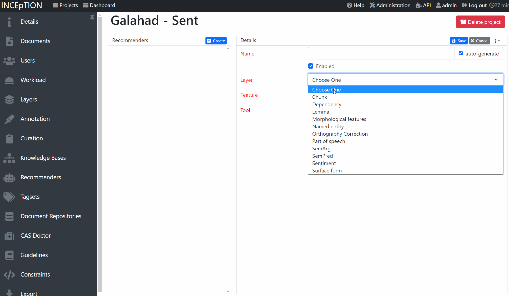
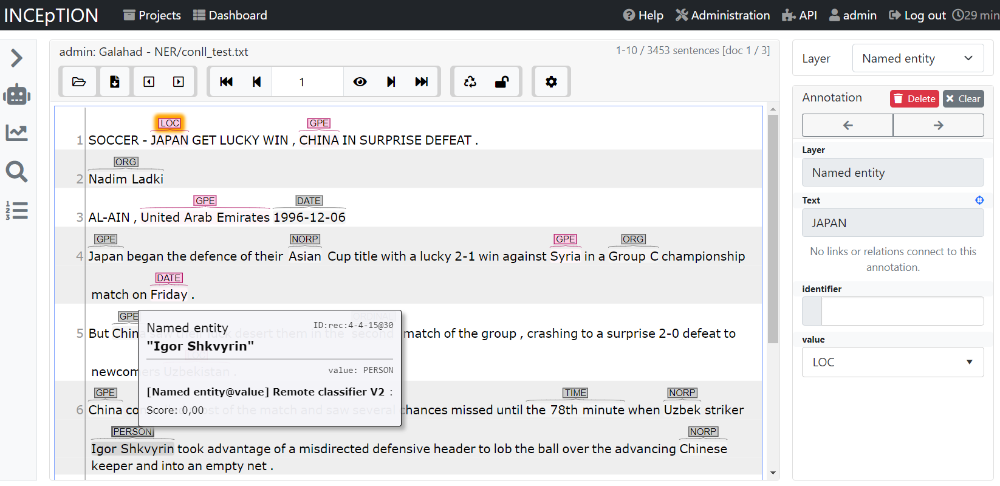

# inception-external-recommender-v2

Machine learning model server for NLP that can predict AND train. It can be e.g. used for interactive machine
learning setups or as an external recommender with [INCEpTION](https://github.com/inception-project/inception).
It provides a REST-like interface and hence is integrable with a wide range of applications and use cases.

## Installation

You can install the newest version via

    pip install galahad

## Usage

`galahad` is a server-based application that uses [FastApi](https://fastapi.tiangolo.com/)
in the background. To get started, create a Python script like the one below.

    import logging
    
    import uvicorn
    
    from galahad.server import GalahadServer
    from galahad.server.contrib.ner.spacy_ner import SpacyNerTagger
    from galahad.server.contrib.pos.spacy_pos import SpacyPosTagger
    from galahad.server.contrib.sentence_classification.sklearn_sentence_classifier import SklearnSentenceClassifier
    
    server = GalahadServer("my_data_folder")
    server.add_classifier("SpacyPOS", SpacyPosTagger("en_core_web_sm"))
    server.add_classifier("SpacyNER", SpacyNerTagger("en_core_web_sm"))
    server.add_classifier("Sent", SklearnSentenceClassifier())
    
    
    if __name__ == "__main__":
        logging.basicConfig(format='%(asctime)s - %(name)s - %(levelname)s - %(message)s', level=logging.DEBUG)
    
        uvicorn.run(server, host="127.0.0.1", port=8000)

This starts `galahad` so that you can use it e.g. together with the `galahad` client
or as a recommender in [INCEpTION](https://inception-project.github.io/).

Alternatively, you can run it on the command line via `uvicorn main:server`, where `main` is the name of your script 
(in this case, *main.py*) and `server` the name of your `GalahadServer` variable.

## API documentation

When running a Galahad instance, you can view the REST API documentation on http://localhost:8000/redoc .

## Examples

`galahad` can be used with a wide range of different clients. A few examples are described in the following:

## INCEpTION

[INCEpTION](https://inception-project.github.io/) is a semantic annotation platform offering intelligent 
assistance and knowledge management. It is widely used in the NLP community for annotating text.
`galahad` can be used to provide annotation suggestions to improve annotation speed and quality.
These can either be static or dynamic. For the latter, `galahad` models are trained and updated during annotation
to provide better suggestions the more data is annotated.

In order to connect INCEpTION and `galahad`, you first need to write a server Python script like above. add models to
your server and then run it. In INCEpTION, in your project, go to the recommender settings.
Add a external recommender V2 to INCEpTION, check the server connection and then select a classifer
from the list. You are now ready to annotate!

  

As an example, here we annotate named entities and use a pre-trained [Spacy](https://spacy.io/) model.
Gray are recommendations and red are real annotations. Annotators can accept, reject or ignore suggestions
made by Galahad.

  

### Gradio

After starting a Galahad instance, you can visualize the predictions of pretrained models via
[Gradio](https://gradio.app/). For that, just run 

    python examples/gradio_demo.py TASK_NAME

We currently support part-of-speech tagging (`pos`) and named entity recognition (`ner`) as tasks.

  

### Python client

Galahad comes with a Python client that you can use to programmatically access the API without worrying about the 
underlying protocol.

## Development

The required dependencies are managed by **pip**. A virtual environment
containing all needed packages for development and production can be
created and activated by

    python3 -m venv venv
    source venv/bin/activate
    pip install -e ".[all]"
    make get_test_dependencies

