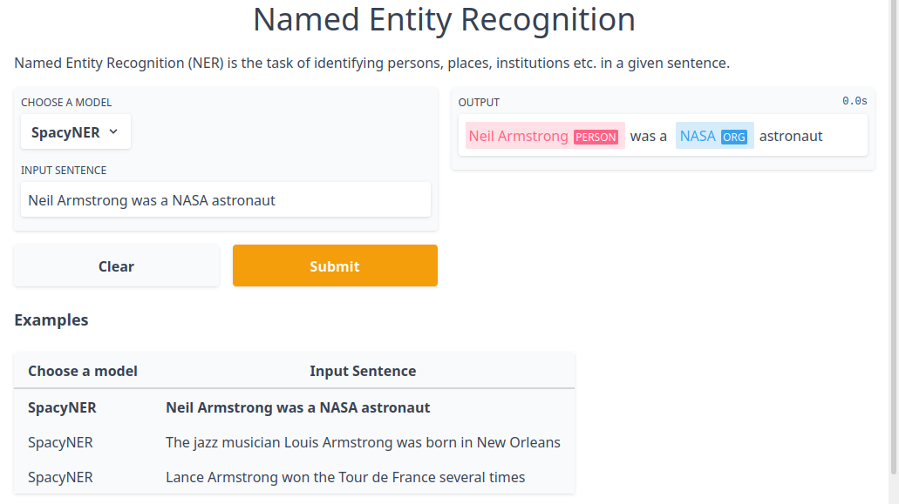

# inception-external-recommender-v2

Machine learning model server that can predict AND train. It can be e.g. used for interactive machine
learning setups or as an external recommender with [INCEpTION](https://github.com/inception-project/inception).

## Installation

You can install the newest version via

    pip install git+https://github.com/inception-project/inception-external-recommender-v2

## Usage

Run via

    make run

## Using it with INCEPTION

Add models to your server and then run via 

    make run

Add a external recommender V2 to INCEpTION, check the server connection and then select a classifer
from the list. You are now ready to go!

## Examples

### Gradio

After starting a Galahad instance, you can visualize the predictions of pretrained models via
[Gradio](https://gradio.app/). For that, just run 

    examples/gradio_demo.py TASK_NAME

We currently support part-of-speech tagging (`pos`) and named entity recognition (`ner`).

  

## API documentation

When running, you can view the API documentation on http://localhost:8000/redoc .

## Development

The required dependencies are managed by **pip**. A virtual environment
containing all needed packages for development and production can be
created and activated by

    python3 -m venv venv
    source venv/bin/activate
    pip install -e .[dev,test]

